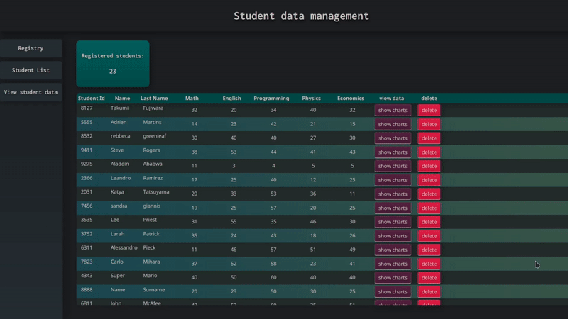

# student-data-visualization
a simple project to use jdbc api and charts from javafx

---

This project was made with the purpose of understanding how to use the JDBC api and apply DAO layers, handle the data with CRUD and show it in charts

